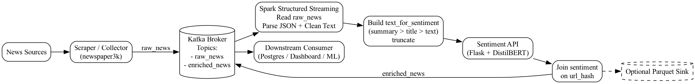

# News Pipeline

A comprehensive, end-to-end data pipeline for scraping, processing, and analyzing news articles from multiple global news sources. This pipeline integrates web scraping, machine learning classification, sentiment analysis, and real-time streaming to provide actionable insights from news data.

## Overview

The News Pipeline automatically collects articles from major news outlets, classifies them by category and sentiment, and streams the results for downstream consumption. The system is designed to be scalable, modular, and easy to extend with new data sources and models.

### Key Features

- **Multi-source Web Scraping**: Crawls news from 13+ news outlets including CNN, BBC, Reuters, New York Times, and more
- **Text Classification**: Machine learning-based article classification
- **Sentiment Analysis**: Transformer-based sentiment scoring using fine-tuned models
- **Real-time Streaming**: Kafka integration for real-time data streaming
- **Multiple Sinks**: Support for JSON, MongoDB, and Kafka outputs
- **Containerized Deployment**: Models served via API with Gunicorn

## Pipeline Architecture

